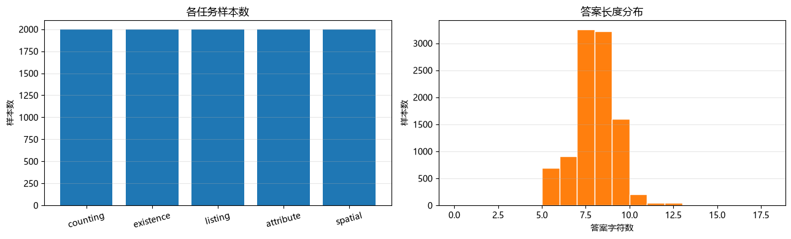
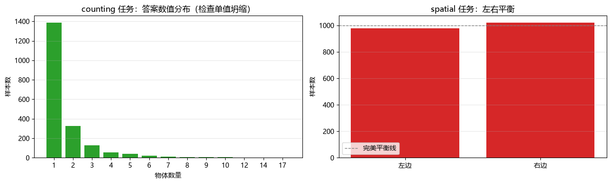

# 数据卡片：baseline_10k.jsonl

> 由 `scripts/make_data_card.py` 自动生成，所有数字为脚本实测

## 1. 总览

| 项 | 值 |
| --- | --- |
| 样本数 | **10,000** |
| 唯一图片数 | **6,679** |
| 每图平均样本数 | 1.50 |
| 任务类别数 | 5 |
| 唯一答案数 | **548** |
| 最高频答案 | `图片主要是人。`（466 次） |
| 多数类基线准确率 | **4.66%** ← 模型必须显著超过它 |
| 真重复（同图+同问+同答） | 0（**0.00%**，验收要求 < 1%） |
| 问答模板重复率 | 94.52%（模板化数据的正常现象，不作验收） |
| 唯一问题数 | 193 |
| 答案长度 均值 / 中位 / P95 | 7.5 / 8 / 9 字 |

## 2. 任务分布

| 任务 | 说明 | 样本数 | 占比 | 唯一答案数 | 最高频答案占比 |
| --- | --- | ---: | ---: | ---: | ---: |
| `counting` | 计数 | 2,000 | 20.0% | 105 | 12.4% |
| `existence` | 存在性 | 2,000 | 20.0% | 40 | 12.5% |
| `listing` | 列举 | 2,000 | 20.0% | 138 | 10.8% |
| `attribute` | 主要物体 | 2,000 | 20.0% | 20 | 23.3% |
| `spatial` | 空间关系 | 2,000 | 20.0% | 245 | 2.9% |

## 3. 空间关系任务的左右平衡（本项目特有检查）

`spatial` 任务的答案里「左边 / 右边」必须接近 1:1 —— 否则模型可以靠「永远答左边」拿到接近 100% 的分数，指标就失去意义。

| 答案 | 数量 | 占比 |
| --- | ---: | ---: |
| 左边 | 978 | 48.9% |
| 右边 | 1022 | 51.1% |

**猜「左边」的基线 = 48.9%** —— 评测 spatial 时必须与这个数对比，而不是与 5% 的随机基线对比。

> 说明：生成器取「中心点 x 差最大的一对不同类别物体」，并以左侧物体作为答案主体。VOC 中人物常出现在画面中部、车辆等物体会偏一侧，因此轻微偏置是数据本身的特性。
## 4. 分布图

*任务分布与答案长度分布*

*counting 数值分布与 spatial 左右平衡*

## 5. 划分与泄漏检查

划分方式：按 **image_id**（不是按样本），种子 42

| 部分 | 图片数 | 样本数 | 占比 |
| --- | ---: | ---: | ---: |
| train | 6,011 | 8,989 | 89.9% |
| val | 333 | 489 | 4.9% |
| test | 335 | 522 | 5.2% |

- 图片跨 split 交集：**passed**（脚本硬校验，有交集会直接报错）

| 部分 | 任务分布 |
| --- | --- |
| train | attribute=1791(20%)  counting=1787(20%)  existence=1810(20%)  listing=1800(20%)  spatial=1801(20%) |
| val | attribute=104(21%)  counting=102(21%)  existence=94(19%)  listing=99(20%)  spatial=90(18%) |
| test | attribute=105(20%)  counting=111(21%)  existence=96(18%)  listing=101(19%)  spatial=109(21%) |

> 为什么必须按 image_id 划分：同一张图会贡献多条问答（counting / existence / listing / ...）。若按样本随机划分，同一张图的问题会同时出现在训练集与验证集，模型只要「记住这张图」，验证指标就会虚高 —— 这是最典型的数据泄漏。

## 6. 验收结论

| 验收项 | 结果 |
| --- | :---: |
| 样本数 ≥ 10000（Final 档） | ✅ |
| 五类任务齐全且配比均衡（各 20%±3%） | ✅ |
| 多数类基线 < 10% | ✅ |
| 重复问答率 < 1%（同图+同问+同答） | ✅ |
| 按 image_id 划分且无泄漏 | ✅ |
| spatial 左右接近平衡（多数边 < 70%） | ✅ |

**无警告。**

